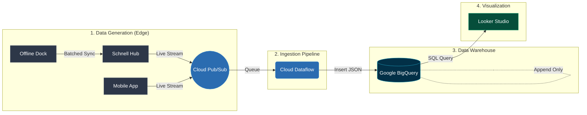

# Schnell Production Analytics Architecture

This document outlines the target production architecture for the Schnell Smart Home Analytics platform. This architecture transitions the system from a localized, batch-processed CSV model into a massively scalable, real-time cloud data pipeline designed specifically for internal engineering and support debugging.

---

## 1. Architectural Philosophy

The core philosophy of this architecture is the strict separation of **State** (operational database) and **Telemetry** (historical logs), utilizing a Data Warehouse to handle massive, append-only log streams from distributed hubs.

### Why not a Custom Frontend?
For internal engineering and debugging, a custom HTML/React frontend limits flexibility. Engineers require the ability to instantly pivot, slice, and filter raw data to diagnose isolated hardware failures at 2:00 AM. Therefore, this architecture relies on robust **Business Intelligence (BI)** tooling rather than custom UI components.

---

## 2. The Tech Stack

| Layer | Technology | Purpose |
| :--- | :--- | :--- |
| **Telemetry Storage** | Google BigQuery | A serverless Data Warehouse. Stores millions of append-only log events and performs sub-second aggregations (e.g., P50 latencies). |
| **State Storage** | PostgreSQL | A traditional relational database. Stores the "current state" (User accounts, Hub configurations, active WiFi networks). |
| **Ingestion Pipeline** | GCP Pub/Sub & Dataflow | The messaging queue that receives raw JSON logs from hubs globally and funnels them into BigQuery safely. |
| **Visualization UI** | Looker Studio (or Power BI) | The BI frontend that connects natively to BigQuery, allowing engineers to build drag-and-drop dashboards and filter raw logs without writing code. |

---

## 3. The End-to-End Data Flow

The following diagram illustrates the exact path a single button press takes from the physical dock all the way to the engineer's dashboard.



### Step 1: Data Generation (The Edge)
The physical hardware abandons local `.csv` generation.
*   **Hubs & Mobile Apps**: As events happen, they stream lightweight JSON payloads over the internet.
*   **Offline Docks**: Docks record events locally when disconnected. When they reconnect, the Hub batches these offline logs and uploads them as a historical payload.

### Step 2: Ingestion Pipeline (Cloud Pub/Sub)
All incoming JSON logs hit **Google Cloud Pub/Sub**. This acts as a shock absorber. If 50,000 hubs all come online at once, Pub/Sub queues the logs safely so no data is lost. Cloud Dataflow pulls these logs from the queue and prepares them for the database.

### Step 3: Storage (Google BigQuery)
Dataflow `INSERT`s the raw JSON logs into BigQuery tables:
*   `unified_event_logs`: The master ledger of all hub/app events.
*   `dock_offline_logs`: The isolated hardware ledger from the docks.
*   **Crucial Note:** BigQuery is an *append-only ledger*. We never run `UPDATE` statements on these logs. If a dock fails, it is recorded as a failure and kept forever.

### Step 4: Visualization (Looker Studio Dashboard)
Looker Studio connects directly to the BigQuery datasets.
*   There are no static `dashboard_data.js` files. Instead, **Looker Studio executes raw SQL queries** directly against the BigQuery ledger.
*   When an engineer opens the dashboard to debug, BigQuery scans millions of rows in milliseconds, calculates the math, and returns the aggregated data to the UI instantly.

---

## 4. Translating Logic to Production SQL

The mathematical logic we developed during the prototyping phase translates perfectly to BigQuery SQL syntax. These formulas are added as **Calculated Fields** in Looker Studio.

### P50 Latency (Median)
BigQuery has built-in functions for calculating exact percentiles across millions of rows efficiently.
```sql
PERCENTILE_CONT(latency_ms, 0.5) OVER() AS p50_latency
```

### Fleet Reliability
```sql
(SUM(CASE WHEN success = true THEN 1 ELSE 0 END) / COUNT(*)) * 100 AS reliability_percentage
```

### Thread Mesh Transit Loss (Dock to Hub)
To calculate how many wireless dock events failed to reach the hub, we run an SQL `JOIN` on the two tables based on the `dock_id` and a specific time window.
```sql
SELECT 
  d.dock_id,
  (COUNT(u.event_id) / SUM(d.total_event_count)) * 100 AS transit_reliability
FROM `schnell.analytics.dock_offline_logs` d
LEFT JOIN `schnell.analytics.unified_event_logs` u 
  ON d.dock_id = u.source_id
GROUP BY d.dock_id
```

---

## 5. Security & Cost Considerations

*   **Cost Management**: BigQuery charges per data scanned. To prevent massive bills from engineers refreshing dashboards, Looker Studio's **BI Engine** (in-memory caching) must be enabled, or BigQuery **Materialized Views** should be used to pre-calculate daily aggregates so the raw logs aren't scanned on every page load.
*   **PII Security**: Telemetry data in BigQuery should be scrubbed of Personally Identifiable Information (PII). Hubs should be identified strictly by their UUID (`hub001`), and cross-referencing that UUID to a customer's real name/address should only occur in the secure PostgreSQL State database.
